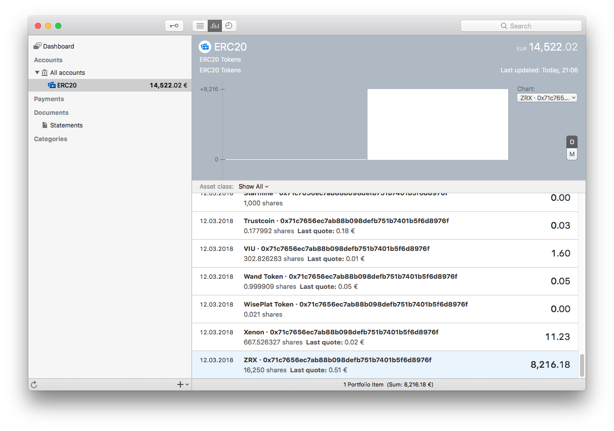

# ERC20-MoneyMoney

Fetches all available ERC20 balances for one or many ETH addresses from Etherscan.io and returns them as securities

## Installation

### Download Signed Extension

You can get a signed version of this extension from

* my [GitHub releases](https://github.com/aaronk6/ERC20-MoneyMoney/releases/latest) page, or
* the [MoneyMoney Extensions](https://moneymoney-app.com/extensions/) page

Once downloaded, move `ERC20.lua` to your MoneyMoney Extensions folder.

### Get Etherscan API Token

* Setup an account on [etherscan.io](https://etherscan.io)
* Go to _API-KEYs_ (in the _My Api-Key | Developers_ section)
* Click on "Create Api Key" Button
* Copy the Api-Key Token

### Account Setup in MoneyMoney

* Add a new account of type “ERC20”
* Enter one or more ETH addresses in the username field (comma-separated)
* Enter your Etherscan Api-Key Token (see above) in the password field

## Known Issues and Limitations

* Always assumes EUR as base currency
* Uses web scraping to get token info (not available via Etherscan API)
* Can be slow if an address holds many different tokens (performs two HTTP requests per token)

